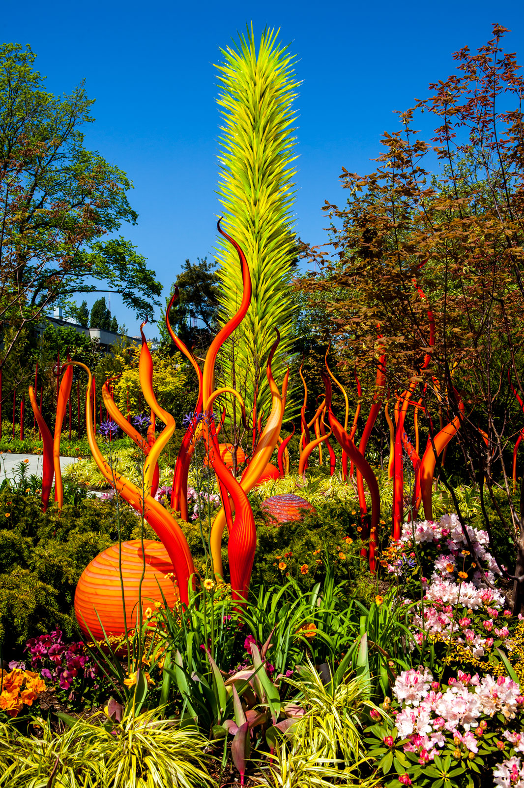

<!DOCTYPE html>
<html lang="en">
<head>
    <meta charset="UTF-8">
    <meta name="viewport" content="width=device-width, initial-scale=1.0">
    
</head>
<body>
    <header class="banner">
        <h1>Alice in Wonderland: An Immersive Experience</h1>
        
Soundtrack Concept Memo

        
by Dominic Mrakovcich

    </header>
</body>
</html>
 

## Forenote
As a composer and sound designer, I am neither a dancer nor the director, so I recognize that my perspectives and suggestions should be approached with a degree of flexibility and critique. This memo is intended to lay out my thought process and the rationale behind my ideas in detail. My aim is to offer a comprehensive view of how I envision the sound design and its integration into the overall experience. I hope this will help convey my vision clearly and foster constructive discussion on how best to bring it to life within the broader context of the production.

## Introduction
**What is Alice *really* about, and how can I capture the essence of that in the sound?** There are *many* interpretations—a child confused by the way adults behave... but the concept that stuck in *my* mind was the notion of distorted references: familiar songs being reworded, and commonplace sayings (from Lewis's time) shown literally, which creates a sense of surrealism, confusion, and humor. This led me to think about the sound design technique of sampling and distorting the familiar through various methods, some involving the accordioning of time, perpetually in a state of afternoon tea.

However!

Distorting familiar sounds won't work unless the audience *is familiar* with the originals. It is crucial that the transformation does not obscure the original enough to become unrecognizable without demonstrating the entire transformation process in a tedious way.

So... who is our audience, and what is familiar to them?

I recognize a contradiction here; while I wish to avoid sampling current-day popular media to maintain immersion, I need to address what elements will connect with the audience. This led me to focus more on sampling the natural world, electronic sounds, and voice-acted dialogue. After all, the most bizarre thing to listen to is the human voice transmogrified.

#### Summary:
- Bizarre, surreal, and immersive
- Overall audio concept of distorting the familiar; however, I still aim for the soundtrack (sound design & music) to remain entirely original and innovative.
- Natural & electric soundscapes created by sampling and transforming (distorting)
    - Voice-acted dialogue from the novel
    - Field recordings (natural & industrial)
    - Snippets of dance tracks, which will be played in full during spotlight events.

## Audio Solutions

### Alice Ambient Radio
An Automated Macro-Sampler. I spent much of the summer designing and testing this software (along with other ancillary software programs that sound good alongside it) as I considered it to be the foundation of my vision for how the soundtrack should sound bizarre and surreal. This software will be pivotal in creating an immersive and organic auditory experience. I tested this via public live streams on YouTube using a large assortment of royalty-free sample packs just for testing purposes, but the samples for the true production will all be originals.

*Examples:*
- [Alice Ambient Radio ~ Trailer](https://www.youtube.com/watch?v=FfPT1U9efBU)
- [Alice Ambient Radio #15 ~ Rains & Grains of Paradise](https://www.youtube.com/watch?v=cFH1KgnEBqU&list=PL7xt4Y5m8lKP0DyTKgjPe9sOOiBZ3iWlq&index=8)
- [Alice Ambient Radio #13 ~ Mountain & Cedar](https://www.youtube.com/watch?v=HEIm3C5WEP8&list=PL7xt4Y5m8lKP0DyTKgjPe9sOOiBZ3iWlq&index=6)
- [Alice Ambient Radio #11 ~ Birds & Tines](https://www.youtube.com/watch?v=gIvD-j5DZXc&list=PL7xt4Y5m8lKP0DyTKgjPe9sOOiBZ3iWlq&index=10)

### Composed Tracks
- Composed songs/dance tracks: I love house music and making electronica, so if we want to incorporate elements of that, I’m all for it. I considered integrating historical dance forms such as the Quadrille with a modern nightclub vibe to enhance relatability and engagement for the audience. This music would be utilized in both ambient instances, perhaps in a more fragmented form, and in what I would call spotlight events, much like arias or solos.

## Surround System as a Garden
For this project, I believe the immersive sound system requires a different approach from traditional surround sound. I envision it as a garden, much like [Chihuly's glass gardens](https://www.chihuly.com/), but with sound where audio is localized and independent to specific zones. The goal is to create a dynamic soundscape that evolves as the audience moves through different areas, enhancing the immersive experience. Chihuly's Glass Gardens have long inspired how I approach composing music. I just wanted to share some examples of his work here to give you perspective on what I'm doing:

Resources For Inspiration:
- [Chihuly Website](https://www.chihuly.com/)
- [Chihuly Garden & Glass](https://www.chihulygardenandglass.com/)

For instance, if you go to one corner, you hear a different soundscape than if you are sitting at the bar table. This setup will be ideal for an environment where the audience can explore and interact with different zones, making the experience more engaging. The music should invite listeners in rather than overwhelming them, i.e., Rainforest Cafe. The idea is to break the venue into zones, each with its own stereo speaker system playing localized audio at a moderate volume. Here is a rough sketch of that layout, quasi-specific to our Vera Bar venue.
 Careful testing of volume and balance will be crucial to prevent unintended sound clashes or distractions. Hearing sounds from across the room and the counterpoint between zones is a great way to develop the music throughout but should be intentional and not just a result of a busy environment. This approach will form the bulk of the soundtrack, with moments when everyone should focus on a player or dancer, similar to an aria or monologue. Transitions between focus moments and general background sound will need to be clear for the dancers, with synchronized systems and coordinated lighting and actor cues. The goal is to create an elasticity of time and emotion; we don't want the audience going home unconvinced, thinking it was thrown together last minute.

### But Wait! How Do We Dance to This?
I would categorize the audio content into two types and actions: Localized Idle Ambience and Centralized Spotlight Events. During the Localized Idle Ambience, the dancers (and players) would be in their respective zones, very much prepared with choreography because although the music within the zone is generated, we will have long pre-decided what the content of that will be and how the dancer should perform to it. I have experience performing with the [Merce Cunningham Trust](https://www.mercecunningham.org/), putting on a revival of their production *Events*. I think this could be some good inspiration for how to dance to ambience like the type I am creating.

During Centralized Spotlight Events, the characters would take on a more commanding role, and the audio will reinforce this by coming together like a powerful chorus, emphasizing key moments and amplifying the drama. This will create a unified sound that draws the audience's focus right where it's needed, making the central action and emotional beats stand out even more.

#### Summary:
- I created automated software that generates the ambience called Alice Ambient Radio.
- Independent ambiences will be localized to various zones and corners of the venue.
- Spotlight events will require more centralized and perhaps rhythm-driven dance tracks for the audience to focus on a particular character or moment.

## Additional Aspects That I Looked Into
Up until now the sound system and softwares I have designed have been entirely free of cost. These additional items would dip into budget, naturally...
**[Flat Panel Speakers](https://www.youtube.com/watch?v=zdkyGDqU7xA&t=1294s)**
This is a more experimental approach, not overly expensive (under $500) but requiring a budget for materials and assembly. It involves integrating audio into the scenery itself, creating high-fidelity speakers from flat pieces of plywood or similar material with contact exciters. This might be saved for another project but is cool to me.

**Sensors for Audience Interaction**
Another aspect of immersion is engaging all the senses. I considered various sensor options,
including motion, humidity, light, infrared, and alcohol percentage sensors, to create a more responsive and interactive environment. These sensors could send data to my software, affecting the audio based on audience presence. While this is an additional feature, I spent a few weeks researching and testing it with Arduino and C++ code. I made my potted plants control my synthesizers based on their moisture level. This organic interaction aligns with my aim for natural-sounding music. This technique works exceptionally well with taking in electrical signals from mushrooms (see [MycoLyco](https://www.youtube.com/watch?v=J-nIBA0V_No)), which is sort of *Alice* but also getting a bit off course. This idea could be reserved for a future project, but sensors are a popular choice for interactive music and installations.

**Theatre For All & Silent Discotheques**
In line with the Theatre for All program, I've been looking into new wireless assisted systems not just for the theatre but for NMU as a whole, working with Michael Bath. I conferred for a while with Hearing Loops Inc., which is at the forefront of this technology, but their price was far too steep—$30K just for the FRT. I am now demoing two much more affordable, under $2,000 non-permanent install options (just a box transceiver) from Sennheiser and Listen Tech.

Since it is just a simple box and can be brought anywhere, I would like it to be available for this production. This technology could also be utilized for anyone with Bluetooth-enabled headphones, making silent discos and narrated exhibits a viable option.

**Video Recording**
This is such an interesting and unique project that I think we should absolutely video record it. With the new equipment available, this should be possible. The small cameras mounted on adjustable clamp arms will allow for flexible and dynamic recording of various angles and moments.

#### Summary:
- I explored various technologies to enhance the immersive experience.
- Video recording and photographing the production will be crucial for creating promotional materials and generating interest.

## Closing
Okay! So that is most of what I have in mind. I am very open to suggestions and criticism. I want to keep my general approach to sampling and immersive surround sound, but the sound world itself can vary greatly depending on the content being played back.

Thank you so much for your time and consideration,

Dominic Mrakovcich, August 2024